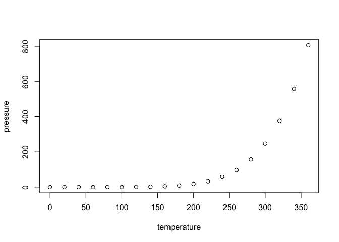

<!-- README.md is generated from README.Rmd. Please edit that file -->

# MOFA2

<!-- badges: start -->

[](https://github.com/jan-spr/MOFA2_privatefork/issues)
[](https://github.com/jan-spr/MOFA2_privatefork/pulls)
[](https://lifecycle.r-lib.org/articles/stages.html#experimental)
[](https://bioconductor.org/checkResults/release/bioc-LATEST/MOFA2)
[](https://bioconductor.org/checkResults/devel/bioc-LATEST/MOFA2)
[](http://bioconductor.org/packages/stats/bioc/MOFA2/)
[](https://support.bioconductor.org/tag/MOFA2)
[](https://bioconductor.org/packages/release/bioc/html/MOFA2.html#since)
[](http://bioconductor.org/checkResults/devel/bioc-LATEST/MOFA2/)
[](https://bioconductor.org/packages/release/bioc/html/MOFA2.html#since)
[](https://github.com/jan-spr/MOFA2_privatefork/actions/workflows/check-bioc.yml)
<!-- badges: end -->

## Bioconductor release status

| Branch | R CMD check | Last updated |
|:--:|:--:|:--:|
| [*devel*](http://bioconductor.org/packages/devel/bioc/html/velociraptor.html) | [](http://bioconductor.org/checkResults/devel/bioc-LATEST/velociraptor) |  |
| [*release*](http://bioconductor.org/packages/release/bioc/html/velociraptor.html) | [](http://bioconductor.org/checkResults/release/bioc-LATEST/velociraptor) | \ |

The goal of `MOFA2` is to …

## Installation instructions

Get the latest stable `R` release from
[CRAN](http://cran.r-project.org/). Then install `MOFA2` from
[Bioconductor](http://bioconductor.org/) using the following code:

``` r
if (!requireNamespace("BiocManager", quietly = TRUE)) {
    install.packages("BiocManager")
}

BiocManager::install("MOFA2")
```

And the development version from
[GitHub](https://github.com/jan-spr/MOFA2_privatefork) with:

``` r
BiocManager::install("jan-spr/MOFA2_privatefork")
```

## Example

This is a basic example which shows you how to solve a common problem:

``` r
library("MOFA2")
#> 
#> Attaching package: 'MOFA2'
#> The following object is masked from 'package:stats':
#> 
#>     predict
## basic example code
```

What is special about using `README.Rmd` instead of just `README.md`?
You can include R chunks like so:

``` r
summary(cars)
#>      speed           dist       
#>  Min.   : 4.0   Min.   :  2.00  
#>  1st Qu.:12.0   1st Qu.: 26.00  
#>  Median :15.0   Median : 36.00  
#>  Mean   :15.4   Mean   : 42.98  
#>  3rd Qu.:19.0   3rd Qu.: 56.00  
#>  Max.   :25.0   Max.   :120.00
```

You’ll still need to render `README.Rmd` regularly, to keep `README.md`
up-to-date.

You can also embed plots, for example:



In that case, don’t forget to commit and push the resulting figure
files, so they display on GitHub!

## Citation

Below is the citation output from using `citation('MOFA2')` in R. Please
run this yourself to check for any updates on how to cite **MOFA2**.

``` r
print(citation("MOFA2"), bibtex = TRUE)
#> To cite package 'MOFA2' in publications use:
#> 
#>   Argelaguet, Velten, Arnol, Dietrich, Zenz, Marioni, Buettner, Huber
#>   and Stegle: Multi‐Omics Factor Analysis — a framework for
#>   unsupervised integration of multi‐omics data sets. Mol Syst Biol
#>   (2018)14:e8124
#> 
#> A BibTeX entry for LaTeX users is
#> 
#>   @Article{,
#>     title = {Multi‐Omics Factor Analysis—a framework for unsupervised integration of multi‐omics data sets},
#>     author = {Ricard Argelaguet and Britta Velten and Damien Arnol and Sascha Dietrich and Thorsten Zenz and John C Marioni and Florian Buettner and Wolfgang Huber and Oliver Stegle},
#>     year = {2018},
#>     journal = {Molecular Systems Biology},
#>     doi = {10.15252/msb.20178124},
#>     volume = {14},
#>   }
#> 
#>   Argelaguet, Arnol, Bredikhin, Deloro, Velten, Marioni,and Stegle:
#>   MOFA+: a statistical framework for comprehensive integration of
#>   multi-modal single-cell data Genome Biology, 21(1), 1-17
#> 
#> A BibTeX entry for LaTeX users is
#> 
#>   @Article{,
#>     title = {MOFA+: a statistical framework for comprehensive integration of multi-modal single-cell data.},
#>     author = {Ricard Argelaguet and Damien Arnol and Danila Bredikhin and Yonatan Deloro and Britta Velten and John C Marioni and Oliver Stegle},
#>     year = {2020},
#>     journal = {Genome Biology},
#>     doi = {10.1186/s13059-020-02015-1},
#>     volume = {21},
#>   }
#> 
#>   Velten, Braunger, Arnol, Argelaguet and Stegle: Identifying temporal
#>   and spatial patterns of variation from multi-modal data using MEFISTO
#>   bioRxiv 2020
#> 
#> A BibTeX entry for LaTeX users is
#> 
#>   @Article{,
#>     title = {Identifying temporal and spatial patterns of variation from multi-modal data using MEFISTO.},
#>     author = {Britta Velten and Jana M. Braunger and Damien Arnol and Ricard Argelaguet and Oliver Stegle},
#>     year = {2020},
#>     journal = {bioRxiv},
#>     doi = {10.1101/2020.11.03.366674},
#>   }
```

Please note that the `MOFA2` was only made possible thanks to many other
R and bioinformatics software authors, which are cited either in the
vignettes and/or the paper(s) describing this package.

## Code of Conduct

Please note that the `MOFA2` project is released with a [Contributor
Code of Conduct](http://bioconductor.org/about/code-of-conduct/). By
contributing to this project, you agree to abide by its terms.

## Development tools

- Continuous code testing is possible thanks to [GitHub
  actions](https://www.tidyverse.org/blog/2020/04/usethis-1-6-0/)
  through *[usethis](https://CRAN.R-project.org/package=usethis)*,
  *[remotes](https://CRAN.R-project.org/package=remotes)*, and
  *[rcmdcheck](https://CRAN.R-project.org/package=rcmdcheck)* customized
  to use [Bioconductor’s docker
  containers](https://www.bioconductor.org/help/docker/) and
  *[BiocCheck](https://bioconductor.org/packages/3.24/BiocCheck)*.
- Code coverage assessment is possible thanks to
  [codecov](https://codecov.io/gh) and
  *[covr](https://CRAN.R-project.org/package=covr)*.
- The [documentation website](http://jan-spr.github.io/MOFA2) is
  automatically updated thanks to
  *[pkgdown](https://CRAN.R-project.org/package=pkgdown)*.
- The code is styled automatically thanks to
  *[styler](https://CRAN.R-project.org/package=styler)*.
- The documentation is formatted thanks to
  *[devtools](https://CRAN.R-project.org/package=devtools)* and
  *[roxygen2](https://CRAN.R-project.org/package=roxygen2)*.

For more details, check the `dev` directory.

This package was developed using
*[biocthis](https://bioconductor.org/packages/3.24/biocthis)*.
